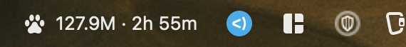

# ClaudeTokenBar

A native macOS menu bar widget that shows your live Claude Code token usage — current 5-hour block total and time until the block resets, with daily totals, cost, and per-model breakdown in the dropdown.



Token accounting (dedup, 5-hour billing blocks, pricing) is delegated to [ccusage](https://github.com/ryoppippi/ccusage); the app is a thin native display layer that watches `~/.claude/projects` for changes via FSEvents.

## Requirements

- macOS 14 or newer (Apple Silicon or Intel)
- Claude Code (the widget reads its local transcripts)
- `ccusage` v20+ on `PATH`, **or** `npx` (the app falls back to `npx -y ccusage@20`)
  - Older global ccusage installs (< v20) are detected and skipped — their pricing tables miss current Claude models and report $0 costs.

## Install

### Homebrew (recommended)

```sh
brew install claud-park/tap/claude-token-bar
```

Follow the caveats printed at the end of the install, then launch:

```sh
open ~/Applications/ClaudeTokenBar.app
```

### From source

```sh
git clone https://github.com/claud-park/claude-token-bar.git
cd claude-token-bar
./Scripts/package.sh
open dist/ClaudeTokenBar.app
```

To start it at login: System Settings → General → Login Items → add `ClaudeTokenBar.app`.

## What it shows

- **Menu bar**: `🐾 55.3M · 2h41m` — active 5-hour block tokens and time until reset (`idle` when no active block, `⚠` on errors).
- **Dropdown**: today's tokens/cost with input/output/cache breakdown, current block detail (burn rate, projected cost at reset), per-model costs, last-updated time, Refresh Now, and a shortcut to the transcripts folder.

## Behavior

- Refreshes on startup, menu open, wake from sleep, a 60-second safety timer, and transcript changes (FSEvents, ~3s debounce).
- Skips the ccusage subprocess entirely when no transcript actually changed (file-signature gate).
- Keeps the last good snapshot if ccusage fails and marks the title with `⚠` — never blanks, never blocks the UI.
- Stores its snapshot cache at `~/Library/Application Support/ClaudeTokenBar/state.json`.
- Runs ccusage from your home directory, never from a project directory (running npx inside a node project corrupts its stdout).

## Build and test

```sh
swift build
swift test
```

## Troubleshooting (macOS 26 Tahoe)

On Tahoe, menu bar items are hosted out-of-process by Control Center:

- If the paw icon is missing while the app is running, run `killall ControlCenter` — the menu bar rebuilds in a second and the item appears. (Some machines fail to adopt items created after Control Center started; a reboot usually settles it.)
- Stale `"NSStatusItem Visible Item-N" = 0` keys in the `com.apple.controlcenter` defaults domain can silently hide third-party items that lack a custom autosave name. This app sets its own autosave name (`ClaudeTokenBar`) to stay clear of that.

## License

[MIT](LICENSE)
